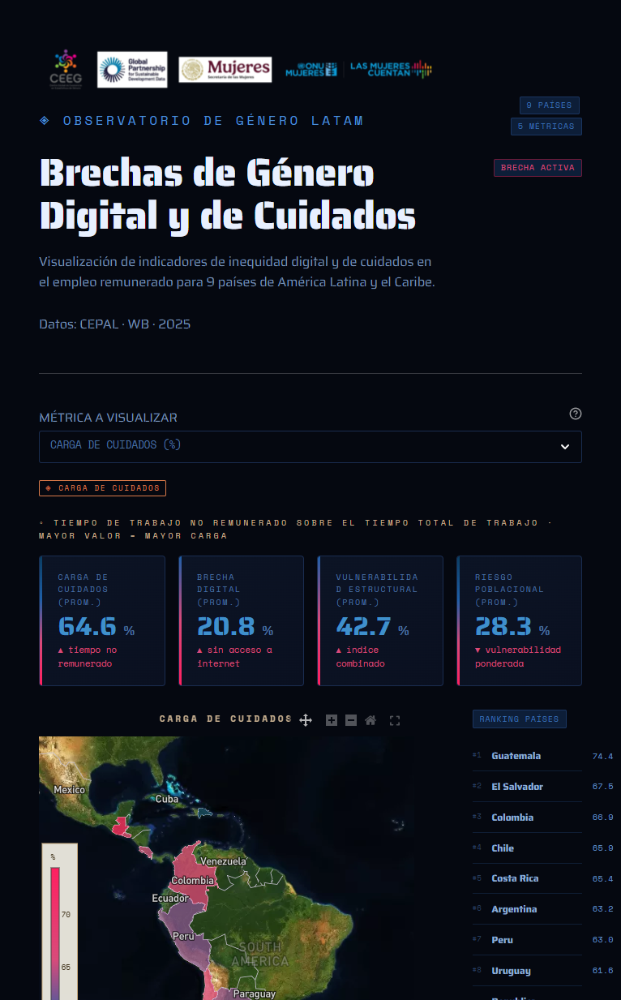
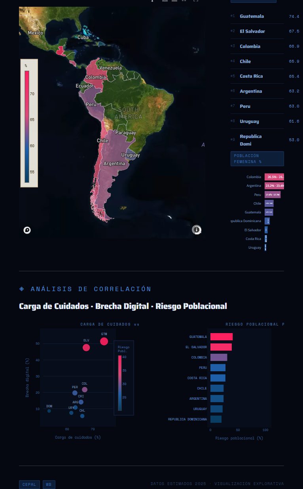

<div align="center">
    
    <h1>Trabajo Remunerado - DATA4CCION</h1>
    <strong>Mapa interactivo que mapea barreras al trabajo remunerado femenino en América Latina,<br>combinando brecha digital y carga de cuidados en un índice de riesgo por país.</strong>
    <br>
    <br>
    <a href="https://trabajoremunerado-dat4ccion.streamlit.app/">
        
    </a>
    <a href="https://colab.research.google.com/drive/1adfLUKryWvWeJg7I01my_3oXpnRIoo4u?usp=sharing">
        
    </a>
    <br>
    <br>
    
    
    
    
    
    
</div>

---

## Demo

La aplicación se encuentra desplegada en Streamlit Cloud:
**https://trabajoremunerado-dat4ccion.streamlit.app/**

---

## Contexto

En 2023, el 66% de las mujeres en edad de máxima productividad que no participaban en la fuerza laboral señalaron la carga de cuidados como la principal razón de su ausencia (ONU Mujeres, 2025). Al mismo tiempo, el 27,6% del empleo femenino global está potencialmente expuesto a la IA generativa, frente al 21,1% del empleo masculino, concentrándose en puestos más vulnerables a la automatización.

Estas barreras estructurales no pueden abordarse de forma aislada: la brecha digital limita la adquisición de habilidades requeridas por el mercado, mientras que la carga de cuidados reduce el tiempo disponible para acceder a oportunidades de formación o empleo.

---

## Propuesta

Mapa interactivo con índice de riesgo combinado por país que integra:

- **Brecha digital de género** — acceso y uso de internet por sexo
- **Carga de cuidados** — tiempo dedicado al trabajo no remunerado por sexo

Cada variable se representa como una capa independiente que puede visualizarse por separado o superponerse. Las zonas con alta brecha digital y alta carga de cuidados se destacan como contextos prioritarios de intervención.

---

## Cobertura geográfica

9 países de América Latina y el Caribe, seleccionados por disponibilidad de datos y diversidad subregional:

- Cono Sur: Argentina, Uruguay, Chile.
- Región Andina: Colombia, Perú.
- Centroamérica y Caribe: Costa Rica, Guatemala, El Salvador, República Dominicana.

---

## Estructura del proyecto

```
Trabajo_Remunerado-DATA4CCION/
├── .gitignore                          # Archivos ignorados por git
├── .python-version                     # Versión de Python requerida (uv)
├── Makefile                            # Comandos de instalación y ejecución
├── README.md                           # Documentación del proyecto
├── pyproject.toml                      # Dependencias y metadatos del proyecto
├── uv.lock                             # Lockfile de dependencias (uv)
│
├── app/                                # Aplicación Streamlit
│   ├── app.py                          # Punto de entrada de la app
│   ├── assets/
│   │   └── images/
│   │       └── onumujereslogo.png      # Logo de ONU Mujeres
│   ├── components/
│   │   ├── charts.py                   # Gráficos de barras y comparativos
│   │   ├── footer.py                   # Pie de página
│   │   ├── header.py                   # Encabezado con logo y título
│   │   ├── map_view.py                 # Mapa interactivo (Plotly + Mapbox)
│   │   └── selector.py                 # Controles de selección de métricas
│   ├── config/
│   │   ├── metric.py                   # Definición de métricas e indicadores
│   │   └── styles.py                   # Estilos y paleta de colores
│   └── data/
│       ├── df_poblacion.csv            # Población femenina por país y grupo etario
│       ├── df_riesgo.csv               # Índice de riesgo poblacional por país
│       ├── df_tiempo_internet.csv      # Tiempos de trabajo y uso de internet por país
│       ├── latam.geojson               # GeoJSON filtrado para América Latina
│       └── loader.py                   # Carga y caché de datasets
│
├── data/                               # Datos fuente crudos
│   ├── Poblacion por genero y edad.csv # Descargado de CEPALSTAT
│   ├── Tiempo total de trabajo.csv     # Descargado de OIG-CEPAL
│   ├── Uso del Internet.csv            # Descargado de Banco Mundial / ITU
│   └── ne_10m_admin_0_countries.geojson # GeoJSON global (Natural Earth, ver abajo)
│
├── notebooks/
│   ├── Databases_DAT4CCION.ipynb       # Exploración y descarga de fuentes
│   └── ETL_EDA_DAT4CCION.ipynb        # ETL completo y análisis exploratorio
│
└── scripts/
    ├── build_latam_geojson.py          # Filtra el GeoJSON global a América Latina
    ├── generate_datasets.py            # Ejecuta el ETL y genera los df_*.csv
    └── tree.py                         # Genera el árbol de directorios
```

---

## Fuentes de datos

### Descarga manual de los CSV fuente

Los archivos en `data/` deben descargarse manualmente desde sus fuentes originales y colocarse con los nombres exactos indicados:

| Archivo | Fuente | Indicador | Link |
|---|---|---|---|
| `Uso del Internet.csv` | Banco Mundial / ITU | Percentage of individuals using the Internet — at least once a day | [data360.worldbank.org](https://data360.worldbank.org/en/indicator/ITU_DH_INT_USR_DAY?sex=F&age=Y_GE75%2CY15T24%2CY0T14%2CY25T74&urbanisation=_T&recentYear=false&view=datatable) |
| `Tiempo total de trabajo.csv` | OIG-CEPAL | Tiempo total de trabajo | [oig.cepal.org](https://oig.cepal.org/es/indicadores?id=2286) |
| `Poblacion por genero y edad.csv` | CEPALSTAT | Estructura de la población por sexo y por grupos de edad (Porcentaje) | [statistics.cepal.org](https://statistics.cepal.org/portal/cepalstat/dashboard.html?theme=1&lang=es) |

### GeoJSON de países (Natural Earth)

El archivo `ne_10m_admin_0_countries.geojson` se obtiene del repositorio de Natural Earth en GitHub:

```
https://github.com/nvkelso/natural-earth-vector/blob/master/geojson/ne_10m_admin_0_countries.geojson
```

Hacer clic en **Raw** y guardar el archivo como `ne_10m_admin_0_countries.geojson` dentro de `data/`. El script `build_latam_geojson.py` lo procesa y genera `app/data/latam.geojson` automáticamente al correr `make load_data`.

---

## Correr la app localmente

### 1. Instalar `make`

**Windows** — ejecutar en PowerShell:
```powershell
winget install GnuWin32.Make; [Environment]::SetEnvironmentVariable("Path", $env:Path + ";C:\Program Files (x86)\GnuWin32\bin", "User")
```
Reiniciar la terminal después de ejecutar el comando.

**Linux (Ubuntu/Debian):**
```bash
sudo apt install make -y
```

### 2. Instalar el entorno

Requiere [uv](https://docs.astral.sh/uv/getting-started/installation/) instalado. Luego:

```bash
make install
```

### 3. Configurar el token de Mapbox

El mapa interactivo usa la API de Mapbox. Para obtener un token gratuito:
1. Crear una cuenta en **https://account.mapbox.com/**
2. Generar un token en el panel de acceso (*Tokens → Create a token*)

Crear el archivo `.streamlit/secrets.toml` en la raíz del proyecto:

```toml
MAPBOX_TOKEN = "pk.eyJ1Ijoixxxxxxx..."
```

### 4. Cargar los datos

Asegurarse de tener los CSV fuente y el GeoJSON en `data/` (ver sección **Fuentes de datos**). Luego:

```bash
make load_data
```

Esto procesa los datos crudos y genera los datasets y el GeoJSON de América Latina en `app/data/`.

### 5. Correr la app

```bash
make run
```

La app estará disponible en `http://localhost:8501`.

---

# Vista previa de la app




## ODS relacionados

| ODS | Descripción |
|-----|-------------|
| ODS 4 | Educación de calidad — acceso a formación y habilidades digitales |
| ODS 5 | Igualdad de género — participación económica equitativa |
| ODS 8 | Trabajo decente — inclusión de mujeres en sectores de mayor valor agregado |

---

## Impacto potencial

Cerrar la brecha digital de género beneficiaría a cerca de **350 millones de mujeres y niñas** a nivel global e impulsaría la economía mundial con una inyección de **1,5 billones de dólares hacia 2030** (ONU Mujeres, 2025).